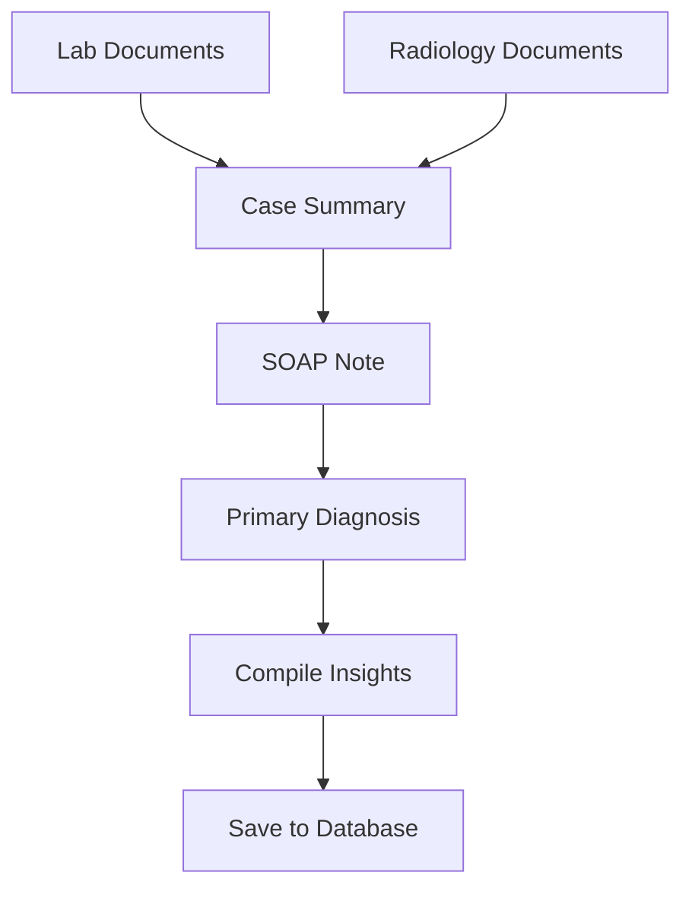

# MedMitra Backend

**An AI-Powered Medical Case Analysis Platform**

MedMitra is a sophisticated backend system that leverages artificial intelligence to assist healthcare professionals in analyzing medical cases. The platform processes medical documents (lab reports, radiology images), generates comprehensive medical insights, and provides structured clinical analysis including SOAP notes, diagnoses, and case summaries.

## 🏗️ System Architecture

MedMitra follows a modular, agent-based architecture designed for scalability and maintainability:

```
┌─────────────────┐    ┌──────────────────┐    ┌─────────────────┐
│   FastAPI App   │    │   Agentic Core   │    │  AI Agents      │
│   (Routes)      │───▶│   Orchestrator   │───▶│  - Medical AI   │
│                 │    │                  │    │  - Vision AI    │
└─────────────────┘    └──────────────────┘    └─────────────────┘
         │                        │                       │
         ▼                        ▼                       ▼
┌─────────────────┐    ┌──────────────────┐    ┌─────────────────┐
│   Supabase      │    │   File Parsers   │    │   LLM Utils     │
│   Database      │    │   (LlamaParse)   │    │   (Groq API)    │
└─────────────────┘    └──────────────────┘    └─────────────────┘
```

## 🚀 Key Features

### 🔬 **Medical Document Processing**
- **PDF Parsing**: Extracts text from medical PDFs using LlamaParse
- **Vision Analysis**: Processes radiology images with AI vision models
- **Multi-format Support**: Handles lab reports, radiology images, and clinical documents

### 🧠 **AI-Powered Medical Analysis**
- **Case Summarization**: Comprehensive analysis of patient cases
- **SOAP Note Generation**: Structured medical documentation
- **Primary Diagnosis**: AI-assisted diagnostic suggestions
- **Evidence-based Insights**: Clinical reasoning with confidence scores

### 📊 **Workflow Management**
- **LangGraph Integration**: Sophisticated state management for complex workflows
- **Background Processing**: Asynchronous handling of large documents
- **Error Handling**: Robust error tracking and recovery mechanisms

### 🏥 **Clinical Data Models**
- **Structured Patient Data**: Standardized patient information handling
- **Medical Terminology**: ICD-10 code integration
- **Confidence Scoring**: AI reliability metrics for all analyses

## 🛠️ Technology Stack

| Component | Technology | Purpose |
|-----------|------------|---------|
| **Web Framework** | FastAPI | High-performance async API |
| **AI Orchestration** | LangGraph | Workflow state management |
| **Language Models** | Groq (Llama 3.3) | Medical text analysis |
| **Vision AI** | Groq Vision Models | Radiology image analysis |
| **Document Parsing** | LlamaParse | PDF text extraction |
| **Database** | Supabase | PostgreSQL with real-time features |
| **File Storage** | Supabase Storage | Secure medical document storage |
| **Data Validation** | Pydantic | Type-safe data models |

## 📁 Project Structure

```
backend/
├── 📄 app.py                 # FastAPI application entry point
├── 🔧 config.py             # Environment configuration
├── 🎯 agentic.py            # Main orchestration logic
├── 📊 models/
│   ├── data_models.py       # Pydantic data models
│   └── state_models.py      # LangGraph state definitions
├── 🤖 agents/
│   ├── medical_ai_agent.py  # Medical analysis agent
│   └── vision_agent.py      # Radiology image analysis
├── 🛣️ routes/
│   └── case.py              # Case management endpoints
├── 📄 parsers/
│   └── parse.py             # PDF document parsing
├── 🗄️ supabase_client/
│   └── supabase_client.py   # Database operations
├── 🔧 utils/
│   ├── base_agent.py        # Abstract agent base class
│   ├── llm_utils.py         # LLM integration utilities
│   ├── medical_prompts.py   # Medical AI prompts
│   └── extractjson.py       # JSON parsing utilities
└── 📦 pyproject.toml        # Project dependencies
```

## 🏃‍♂️ Quick Start

### Prerequisites
- Python 3.13+
- Supabase account and project
- Groq API key
- LlamaParse API key

### Installation

1. **Clone the repository**
```bash
git clone <repository-url>
cd medmitra/backend
```

2. **Install dependencies**
```bash
pip install -r requirements.txt
# or using uv
uv sync
```

3. **Environment Setup**
Create a `.env` file with:
```env
SUPABASE_URL=your_supabase_url
SUPABASE_SERVICE_ROLE_KEY=your_service_role_key
GROQ_API_KEY=your_groq_api_key
LLAMAPARSE_API_KEY=your_llamaparse_api_key
WEAVIATE_API_KEY=your_weaviate_api_key  # Optional
WEAVIATE_REST_URL=your_weaviate_url     # Optional
```

4. **Database Setup**
Set up the following tables in Supabase:
- `cases` - Store medical case information
- `case_files` - Store uploaded medical documents
- `ai_insights` - Store AI-generated medical insights

5. **Run the application**
```bash
uvicorn app:app --host 0.0.0.0 --port 8000 --reload
```

The API will be available at `http://localhost:8000`

## 📡 API Endpoints

### Case Management

#### Create New Case
```http
POST /cases/create_case
Content-Type: multipart/form-data

{
  "user_id": "doctor-uuid",
  "patient_name": "John Doe",
  "patient_age": 45,
  "patient_gender": "Male",
  "case_summary": "Patient presents with chest pain",
  "lab_files": [file1.pdf, file2.pdf],
  "radiology_files": [xray1.jpg, ct_scan.jpg]
}
```

#### Get All Cases
```http
GET /cases/all_cases?user_id=doctor-uuid
```

#### Get Specific Case
```http
GET /cases/cases/{case_id}
```

### Response Format
```json
{
  "case": {
    "case_id": "uuid",
    "patient_name": "John Doe",
    "status": "completed",
    "created_at": "2024-01-01T00:00:00Z"
  },
  "files": [...],
  "ai_insights": {
    "case_summary": {...},
    "soap_note": {...},
    "primary_diagnosis": {...}
  }
}
```

## 🔄 Processing Workflow

The system follows a sophisticated multi-stage processing pipeline:

### 1. **File Upload & Storage**
- Files uploaded to Supabase Storage
- Metadata stored in database
- Background processing initiated

### 2. **Document Processing**
- **Lab Files**: PDF text extraction via LlamaParse
- **Radiology Files**: Image analysis via Groq Vision AI
- Extracted data stored with file metadata

### 3. **AI Analysis Pipeline**
The medical AI agent processes data through multiple stages:



#### Stage Details:
- **Lab Analysis**: Extract values, identify abnormalities
- **Radiology Analysis**: Interpret imaging findings
- **Case Summary**: Comprehensive patient overview
- **SOAP Note**: Structured clinical documentation
- **Diagnosis**: Primary diagnosis with ICD codes
- **Insights Compilation**: Final medical report

### 4. **Quality Assurance**
- Confidence scores for all AI outputs
- Error tracking and recovery
- Medical terminology validation

## 🧩 Core Components

### Medical AI Agent (`agents/medical_ai_agent.py`)
- **Purpose**: Orchestrates the complete medical analysis workflow
- **Key Features**:
  - LangGraph-based state management
  - Multi-stage processing pipeline
  - Confidence scoring for all outputs
  - Structured medical data extraction

### Vision Agent (`agents/vision_agent.py`)
- **Purpose**: Analyzes radiology images and medical scans
- **Capabilities**:
  - Image-to-text analysis
  - Medical finding extraction
  - Impression generation

### Supabase Client (`supabase_client/supabase_client.py`)
- **Purpose**: Manages all database operations
- **Features**:
  - Case management (CRUD operations)
  - File upload and metadata storage
  - AI insights storage and retrieval
  - Error handling and validation

### LLM Utils (`utils/llm_utils.py`)
- **Purpose**: Standardized AI model interactions
- **Features**:
  - Groq API integration
  - Prompt template management
  - JSON response parsing

## 🔒 Security & Privacy

- **Data Encryption**: All sensitive data encrypted at rest
- **Access Control**: User-based case isolation
- **API Security**: CORS configuration for web integration
- **Medical Compliance**: Structured data handling for healthcare requirements

## 🎯 Medical AI Prompts

The system uses specialized medical prompts for different analysis types:

- **Lab Analysis**: Structured extraction of laboratory values
- **Radiology Analysis**: Image finding interpretation
- **Case Summarization**: Comprehensive case overview
- **SOAP Notes**: Clinical documentation generation
- **Diagnosis**: Primary diagnosis with evidence

## 📊 Data Models

### Patient Data
```python
class PatientData(BaseModel):
    name: str
    age: int
    gender: str
```

### Medical Insights
```python
class MedicalInsights(BaseModel):
    case_summary: CaseSummary
    soap_note: SOAPNote
    primary_diagnosis: Diagnosis
    overall_confidence_score: float
    generated_at: datetime
```

## 🚧 Development Status

### ✅ Completed Features
- Core case management API
- Document processing pipeline
- Medical AI analysis workflow
- Database integration
- Vision analysis for radiology

### 🔄 In Progress
- Differential diagnosis generation
- Treatment recommendations
- Investigation suggestions

### 🎯 Planned Features
- Real-time collaboration
- Advanced medical terminology integration
- Multi-language support
- Clinical decision support tools


## 📄 License

This project is licensed under [Your License] - see the LICENSE file for details.

## 🆘 Support

For support, please contact the development team or create an issue in the repository.

---

**Note**: This is a medical AI assistant tool designed to support healthcare professionals. All AI-generated insights should be reviewed by qualified medical practitioners before use in clinical decision-making.
